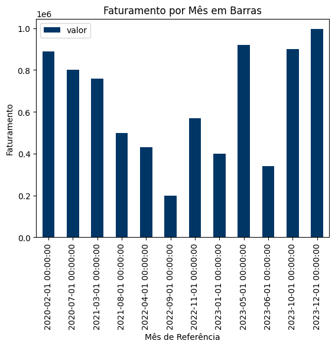
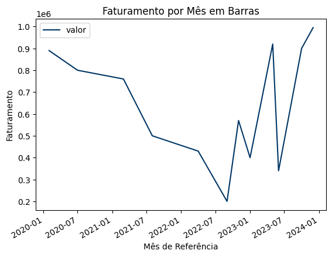

# desafio_IA_RocketSeat

Este é o primeiro desafio proposto pela RocketSeat no módulo de IA.

O primeiro desafio proposto tem a finalidade de botar em prática alguns conceitos em estatística e transformar dados em gráficos na linguagem Python.

<br>

## Enunciado

> Com base nas aulas do módulo de Estatística, utilize os métodos da biblioteca Pandas para tratar o dicionário abaixo e:
>- Trazer a média das vendas;
>- Criar um gráfico de barras vertical mostrando o mês de referência e o valor;
>- Criar um gráfico de linhas mostrando o mês de referência e o valor.

____

<br>

## Base de Dados
### Python
````
dict_faturamento = {
    'data_ref': [
        '2023-01-01', 
        '2020-02-01', 
        '2021-03-01', 
        '2022-04-01', 
        '2023-05-01',
        '2023-06-01', 
        '2020-07-01', 
        '2021-08-01', 
        '2022-09-01', 
        '2023-10-01',
        '2022-11-01', 
        '2023-12-01'
    ],
    'valor': [
        400000, 
        890000, 
        760000, 
        430000, 
        920000,
        340000, 
        800000, 
        500000, 
        200000, 
        900000,
        570000, 
        995000
    ]
}
````

<br>

Com a base proposta, transformei o dicionário em um DataFrame

<br>

````df_faturamento = pd.DataFrame.from_dict(dict_faturamento)````

E a base ficou da seguinte forma:

<div>
<style scoped>
    .dataframe tbody tr th:only-of-type {
        vertical-align: middle;
    }

    .dataframe tbody tr th {
        vertical-align: top;
    }

    .dataframe thead th {
        text-align: right;
    }
</style>
<table border="1" class="dataframe">
  <thead>
    <tr style="text-align: right;">
      <th></th>
      <th>data_ref</th>
      <th>valor</th>
    </tr>
  </thead>
  <tbody>
    <tr>
      <th>0</th>
      <td>2023-01-01</td>
      <td>400000</td>
    </tr>
    <tr>
      <th>1</th>
      <td>2020-02-01</td>
      <td>890000</td>
    </tr>
    <tr>
      <th>2</th>
      <td>2021-03-01</td>
      <td>760000</td>
    </tr>
    <tr>
      <th>3</th>
      <td>2022-04-01</td>
      <td>430000</td>
    </tr>
    <tr>
      <th>4</th>
      <td>2023-05-01</td>
      <td>920000</td>
    </tr>
    <tr>
      <th>5</th>
      <td>2023-06-01</td>
      <td>340000</td>
    </tr>
    <tr>
      <th>6</th>
      <td>2020-07-01</td>
      <td>800000</td>
    </tr>
    <tr>
      <th>7</th>
      <td>2021-08-01</td>
      <td>500000</td>
    </tr>
    <tr>
      <th>8</th>
      <td>2022-09-01</td>
      <td>200000</td>
    </tr>
    <tr>
      <th>9</th>
      <td>2023-10-01</td>
      <td>900000</td>
    </tr>
    <tr>
      <th>10</th>
      <td>2022-11-01</td>
      <td>570000</td>
    </tr>
    <tr>
      <th>11</th>
      <td>2023-12-01</td>
      <td>995000</td>
    </tr>
  </tbody>
</table>
</div>

<br>

Após a criação do DF, ajustei o campo ***data_ref*** para o formato ***datetime64***, pois no primeiro momento, ele é interpretado como ***object***:

````df_faturamento['data_ref'] = pd.to_datetime(df_faturamento['data_ref'])````

E abaixo temos o formato da coluna.

````df_faturamento.info()````

````
<class 'pandas.core.frame.DataFrame'>
RangeIndex: 12 entries, 0 to 11
Data columns (total 2 columns):
 #   Column    Non-Null Count  Dtype         
---  ------    --------------  -----         
 0   data_ref  12 non-null     datetime64[ns]
 1   valor     12 non-null     int64         
dtypes: datetime64[ns](1), int64(1)
memory usage: 324.0 bytes
````

<br>

## Média do Faturamento

Para a média de faturamento, uitilizei a função ***mean*** e formatei para printar as duas casas decimais:

````
media_faturamento = df_faturamento.valor.mean()
print(f'$ {media_faturamento:.2f}')
````

____
Output:

````$ 642083.33````

<br>

## Gráfico de Barras Vertical - Mês e Valor

Utilizei a função ***plot.bar*** para poder gerar o gráfico de barras, mas com a função ***sort_values***, utilizando o campo ***data_ref*** como eixo X e de forma crescente.

````
faturamento_bar = df_faturamento.sort_values('data_ref', ascending=True).plot.bar(
    x='data_ref', y='valor', color="#003666", 
    title="Faturamento por Mês em Barras", xlabel='Mês de Referência', ylabel='Faturamento'
)
````
____

Output:



<br>

## Gráfico de Linhas - Mês de Referência e o Valor

Utilizei o mesmo formato do tópico anterior, porém, criando o gráfico de linhas

````
faturamento_line = df_faturamento.sort_values('data_ref', ascending=True).plot.line(
    x='data_ref', y='valor', color="#003666", 
    title="Faturamento por Mês em Barras", xlabel='Mês de Referência', ylabel='Faturamento'
)
````



<br><br>


# Análise Final

Com a base de dados proposta, mais por ser um estudo básico sobre funcionalidades das bibliotecas ***Pandas*** e ***MatPlotLib***, não conseguimos ter uma análise mais profunda sobre os dados, pois as datas informadas estão variadas, não mantendo um padrão. 

Mas, pelos dados apresentados, podemos concluir que o faturamento da Empresa X foi um valor alto num primeiro momento, porém que a medida do tempo, foi caindo até chegar no faturamento mínimo registrado em *01/09/2022*. Após essa data, tivemos faturamentos que variavam a cada registro, atingindo um novo pico de faturamento em *01/05/2023*, tendo uma queda no registro seguinte, mas que retornou o crescimento nos próximos dois registros.

<br><br>

## 🚀 Sobre mim
Meu nome é Giovani Duarte, tenho 30 anos, sou Analista de Dados sou de Belo Horizonte/MG. 

## 🔗 Links
[](https://github.com/djovas)
[](https://www.linkedin.com/in/giovani-duarte-de-souza/)